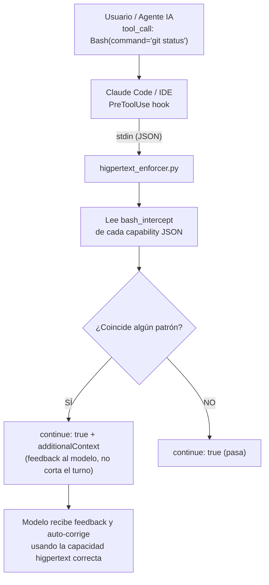
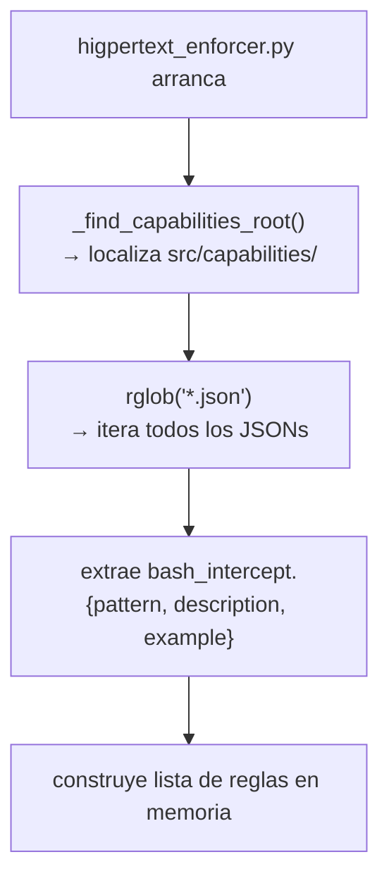

<!-- higpertext:generated-by=docs-maintenance -->
# Referencia de Hooks — higpertext Engine

Documentación técnica del sistema de hooks: arquitectura, flujo de ejecución,
intercepción de comandos bash y cómo extender las reglas.

---

## Arquitectura del Sistema de Hooks



---

## Tipos de Hook

| Tipo | Comportamiento | Cuándo se usa |
|---|---|---|
| **Redirección** | `continue: true` + `additionalContext` | Comando bash con capacidad higpertext equivalente |
| **Bloqueo duro** | `continue: false` | Violaciones de seguridad (`sudo`, comandos destructivos) |

> **Clave**: las redirecciones usan `continue: true` para que el modelo reciba
> el feedback sin cortar el turno ni la cadena de pensamiento.

---

## Whitelist — Comandos que nunca se interceptan

```python
htx | .venv/bin/htx  # el propio higpertext
git add | git push | git checkout            # operaciones git de usuario
git merge | git rebase | git stash | git tag
```

---

## Reglas Dinámicas — `bash_intercept`

El `higpertext_enforcer.py` **no tiene reglas hardcodeadas**. En cada ejecución escanea
todos los `*.json` de capacidades y extrae el campo `bash_intercept`:

```json
{
  "bash_intercept": {
    "pattern": "\\bgit\\s+ls-files\\b",
    "description": "Listar archivos trackeados en el índice git",
    "example": "htx task git.ls-files --pattern \"<filtro>\"" 
  }
}
```

**Flujo de carga**:


**Ventaja**: agregar una nueva capacidad con `bash_intercept` activa
automáticamente su intercepción sin tocar el hook.

---

## Hook Intercepts activos

| Capacidad | Patrón interceptado | Descripción | Comando correcto |
|---|---|---|---|
| `common.code-skeletonizer` | `\bwc\s+-l\b|\bfind\s+.*\.(py|ts|js|cs)\b` | Explorar estructura de archivos de código | `htx task common.code-skeletonizer --path src/my_module.py` |
| `common.dep-manager` | `\bpip\s+(install|uninstall|freeze)\b` | Gestionar dependencias del proyecto | `htx task common.dep-manager --action install --packages requests` |
| `common.grep-search` | `\bgrep\b` | Buscar en el código | `htx task common.grep-search --pattern "<patrón>" --path <ruta>` |
| `common.knowledge-asker` | `\bcat\s+.*\.(md|json|yaml|yml|txt)\b` | Consultar documentación o gobernanza | `htx task common.knowledge-asker --query "<pregunta>"` |
| `git.committer` | `\bgit\s+commit\b` | Hacer un commit | `htx task git.committer --message "<mensaje del commit>"` |
| `git.diff` | `\bgit\s+(diff|status|log)\b` | Ver diff/estado del repositorio | `htx task git.git-diff --detail true` |
| `git.ls-files` | `(^|[;&|]\s*)ls(\s|$)|\bgit\s+ls-files\b` | Listar archivos trackeados en el índice git | `htx task git.ls-files --path src --mode summary` |
| `git.rm` | `\bgit\s+rm\b` | Remover archivos del índice git | `htx task git.git-rm --files "<archivo1,archivo2>"` |

---

## Cómo agregar una nueva regla de intercepción

1. Abre el JSON de tu capacidad en `src/capabilities/<area>/<id>.json`
2. Agrega el campo `bash_intercept`:
   ```json
   {
     "bash_intercept": {
       "pattern": "\\bmi-comando\\b",
       "description": "Descripción de qué hace",
       "example": "htx task mi-area.mi-cap --param valor"
     }
   }
   ```
3. Re-despliega los hooks: `htx profile load <perfil> --assistant claude`
4. La regla estará activa en el siguiente turno del agente.

> No es necesario editar `higpertext_enforcer.py`.

---

## Cómo agregar un bloqueo duro

Los bloqueos duros (como `sudo`) se definen directamente en `_HARD_BLOCKS`
dentro de `src/core/hooks/hook_tasks/higpertext_enforcer.py`:

```python
_HARD_BLOCKS = [
    (r"\bsudo\b", "sudo no está permitido por política de seguridad"),
    (r"\brm\s+-rf\b", "rm -rf está bloqueado — usa git.rm"),
]
```

---

## Archivos relevantes

| Archivo | Rol |
|---|---|
| `src/core/hooks/hook_tasks/higpertext_enforcer.py` | Hook principal — carga reglas y evalúa comandos |
| `src/core/hooks/hook_tasks/hook_utils.py` | Utilidades: `get_project_root()`, `run_higpertext_task()` |
| `src/core/hooks/hook_registry.py` | Filtra hooks por asistente y perfil |
| `src/core/hooks/hook_renderer.py` | Genera config nativa por asistente (Claude, Gemini, Copilot) |
| `src/core/hooks/config_loader.py` | Carga `.higpertext/hooks_config.json` |
| `.higpertext/hooks_config.json` | Registro de hooks activos con filtros por asistente/perfil |

---

[Volver al Índice](../README.md)